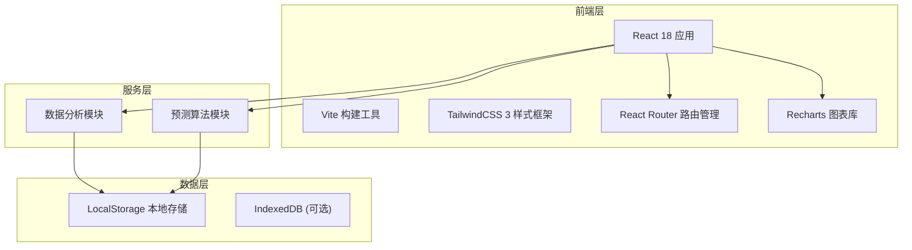
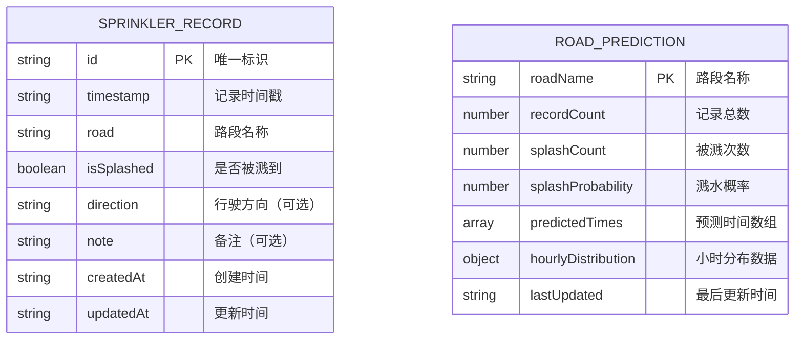

## 1. 架构设计



## 2. 技术描述

- **前端框架**：React 18 + TypeScript + Vite 5
- **样式方案**：TailwindCSS 3.4 + PostCSS
- **路由管理**：React Router v6
- **图表库**：Recharts 2.x
- **状态管理**：React Hooks (useState, useReducer, useContext)
- **数据持久化**：LocalStorage (封装本地存储工具类)
- **图标库**：Lucide React
- **初始化工具**：npm create vite@latest
- **后端**：无（纯前端应用，数据本地存储）
- **数据库**：LocalStorage（JSON格式存储记录数据）

## 3. 目录结构

```
src/
├── components/          # 公共组件
│   ├── Layout/         # 布局组件
│   ├── Card/           # 卡片组件
│   ├── Button/         # 按钮组件
│   ├── TimePicker/     # 时间选择组件
│   └── Charts/         # 图表组件
├── pages/              # 页面组件
│   ├── Dashboard/      # 首页仪表盘
│   ├── Record/         # 记录页面
│   ├── Schedule/       # 时刻表页面
│   ├── History/        # 历史记录页面
│   └── Statistics/     # 统计分析页面
├── hooks/              # 自定义 Hooks
│   ├── useStorage.ts   # 本地存储 Hook
│   ├── usePrediction.ts # 预测算法 Hook
│   └── useStatistics.ts # 统计分析 Hook
├── utils/              # 工具函数
│   ├── storage.ts      # 本地存储封装
│   ├── analysis.ts     # 数据分析工具
│   ├── prediction.ts   # 预测算法
│   └── format.ts       # 格式化工具
├── types/              # TypeScript 类型定义
│   └── index.ts
├── context/            # React Context
│   └── AppContext.tsx  # 全局状态管理
├── data/               # Mock 数据
│   └── mockRecords.ts  # 示例记录数据
├── App.tsx             # 根组件
├── main.tsx            # 入口文件
└── index.css           # 全局样式
```

## 4. 路由定义

| 路由 | 页面 | 功能描述 |
|------|------|----------|
| / | Dashboard | 首页仪表盘 - 今日预测、快速记录、概览统计 |
| /record | Record | 记录页面 - 新增洒水车出没记录 |
| /record/:id | Record | 编辑页面 - 编辑历史记录 |
| /schedule | Schedule | 时刻表页面 - 各路段洒水车预测时间 |
| /history | History | 历史记录页面 - 查看管理所有记录 |
| /statistics | Statistics | 统计分析页面 - 图表展示数据规律 |

## 5. 数据模型

### 5.1 数据模型定义



### 5.2 TypeScript 类型定义

```typescript
// 洒水车记录
interface SprinklerRecord {
  id: string;
  timestamp: number;
  date: string;
  time: string;
  hour: number;
  minute: number;
  road: string;
  isSplashed: boolean;
  direction?: 'east' | 'west' | 'south' | 'north';
  note?: string;
  createdAt: number;
  updatedAt: number;
}

// 路段预测数据
interface RoadPrediction {
  roadName: string;
  recordCount: number;
  splashCount: number;
  splashProbability: number;
  predictedTimes: Array<{
    hour: number;
    probability: number;
    averageTime: string;
    confidence: number;
  }>;
  hourlyDistribution: Record<number, number>;
  lastUpdated: number;
}

// 统计数据
interface StatisticsData {
  totalRecords: number;
  totalSplashed: number;
  splashRate: number;
  recordsByDay: Array<{ date: string; count: number }>;
  recordsByHour: Array<{ hour: number; count: number }>;
  topRoads: Array<{ road: string; count: number; splashRate: number }>;
  heatmapData: Array<{ hour: number; day: number; count: number }>;
}

// 应用状态
interface AppState {
  records: SprinklerRecord[];
  predictions: RoadPrediction[];
  statistics: StatisticsData | null;
  isLoading: boolean;
}
```

### 5.3 本地存储结构

```typescript
// LocalStorage Key 定义
enum StorageKeys {
  RECORDS = 'sprinkler_records',
  PREDICTIONS = 'sprinkler_predictions',
  SETTINGS = 'sprinkler_settings',
}

// 设置数据
interface AppSettings {
  theme: 'light' | 'dark';
  reminderEnabled: boolean;
  reminderMinutes: number;
  favoriteRoads: string[];
}
```

## 6. 核心算法模块

### 6.1 预测算法

- **时间聚类**：使用 K-means 聚类算法对同一路段的洒水车出没时间进行分组
- **置信度计算**：基于记录数量和时间集中度计算预测置信度
- **概率分布**：按小时统计出没频率，生成概率分布曲线
- **趋势预测**：基于历史数据预测未来几天的出没规律

### 6.2 数据分析

- **按路段分组**：将记录按路段名称分组统计
- **时间分布分析**：按小时、星期几进行多维度分析
- **溅水概率计算**：计算各路段的溅水概率
- **常用路段识别**：基于记录频率识别用户常用路段

## 7. Mock 数据

为了便于演示，将提供约 50-100 条模拟记录数据，涵盖：
- 5-8 个不同路段
- 覆盖早高峰（7:00-9:00）和晚高峰（17:00-19:00）
- 包含不同的溅水状态
- 时间跨度约 30 天
